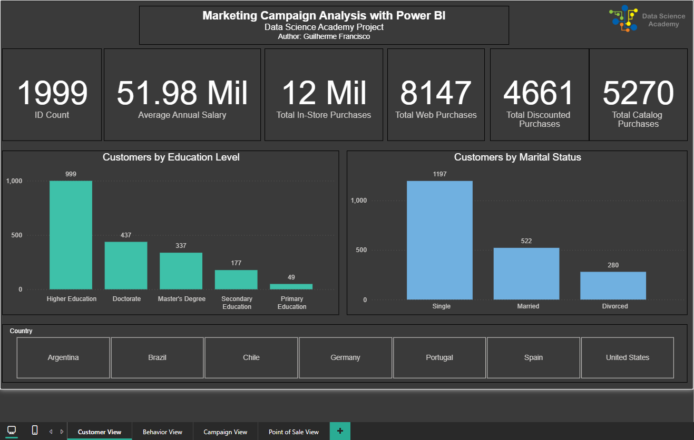

# 📊 Marketing Campaign Analysis Dashboard

## 🔎 Project Overview  
This Power BI dashboard analyzes customer behavior across regions, income levels, and spending patterns to uncover insights for targeted marketing strategies. It showcases key Power BI capabilities including data cleaning, DAX measures, and dynamic visual storytelling.

> 🧪 This project was developed as part of the [Data Science Academy (DSA)](https://www.datascienceacademy.com.br/start) training program, focused on practical skills in data analysis and business intelligence.

## 🧠 Key Learnings  
- Applied **regional segmentation logic** using translated country filters  
- Grouped customers by **marital status**, **income brackets**, and **spending behavior**  
- Visualized relationships between **annual spending** and **average salary**  
- Built **interactive slicers** for behavior-based filtering and drill-down analysis  
- Designed a **hierarchical tree map** to explore multi-level customer categories  

## 📈 Dashboard Highlights  
- ✅ Clean, recruiter-friendly layout with intuitive slicers  
- ✅ Tree map showing customer segments by category and subcategory  
- ✅ Bar charts comparing spending and salary averages across regions  
- ✅ Filters that dynamically update all visuals  
- ✅ Clear titles and labels for global readability  

## 🛠️ Tools Used

| Tool         | Purpose                            |
|--------------|------------------------------------|
| Power BI     | Dashboard creation and modeling    |
| Excel        | Data source and preprocessing      |
| DAX          | Custom measures and calculations   |
| Git & GitHub | Version control and documentation  |

## 🖼️ Dashboard Overview

## 📁 Project Structure

📦 Mini Project 1  
├── 📊 Mini_Project1_Marketing_Campaign_Analysis.pbix  
├── 📄 Mini_Project1_Marketing_Dataset.csv  
└── 🖼️ Images/ ├── dashboard_overview.png  

## 🌍 Portfolio Impact  
This project demonstrates my ability to transform raw marketing data into actionable insights using Power BI. It reflects my strengths in data cleaning, segmentation logic, and visual clarity skills for analytics roles and dashboard development.

---
